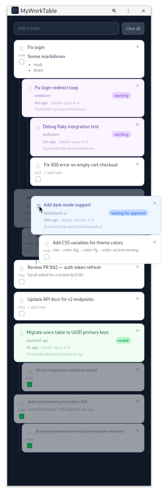

# MyWorkTable

A lightweight desktop dashboard for managing todos and monitoring [Claude Code](https://docs.anthropic.com/en/docs/claude-code) sessions. Built with Rust (Axum) and served as a local web app.

Totally vibecoded. Didn't even read it.



## Features

- **Todos** — create, edit, reorder, and check off tasks with markdown notes
- **Claude Code sessions** — see active sessions with their status (working / waiting for approval / ended), model, and project path
- **Installable** — works as a standalone PWA via the web app manifest

## Running

```
cargo run
```

Opens at [http://127.0.0.1:5544](http://127.0.0.1:5544).

## Claude Code Hooks

To monitor sessions, merge [claude-hooks.json](claude-hooks.json) into your Claude Code settings (`~/.claude/settings.json`). It registers HTTP hooks for all relevant events:

`SessionStart`, `UserPromptSubmit`, `PermissionRequest`, `PreToolUse`, `PostToolUse`, `Notification`, `Stop`, `SubagentStart`, `SubagentStop`, `SessionEnd`

The server maps event names to session status:

| Pattern in event name | Session status       |
| --------------------- | -------------------- |
| `Stop`, `End`         | ended                |
| `PermissionRequest`   | waiting for approval |
| anything else         | working              |

The first `UserPromptSubmit` event sets the session title from the user's input.

## Stack

- [Axum](https://github.com/tokio-rs/axum) — HTTP server
- [SQLx](https://github.com/launchbadge/sqlx) + SQLite — persistence
- [Askama](https://github.com/djc/askama) — HTML templates
- [HTMX](https://htmx.org) + [Sortable.js](https://sortablejs.github.io/Sortable/) — interactivity
- [Tailwind CSS](https://tailwindcss.com) — styling
